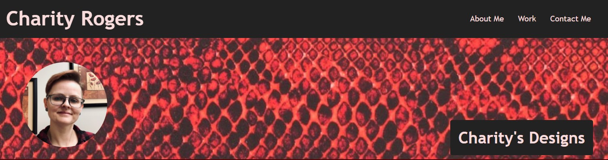
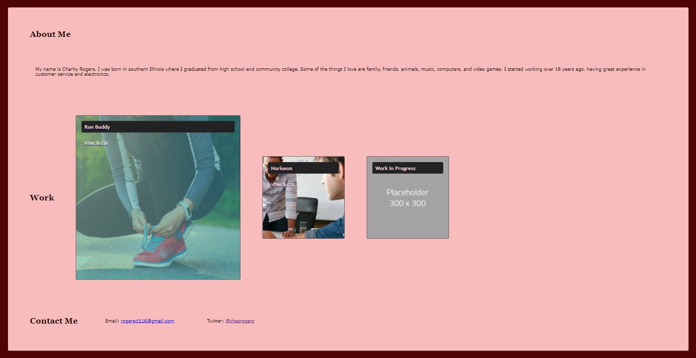

# My Professional Portfolio - Charity's Designs

## Objective

Create a website including my name, recent photo and links to sections about me, my work and how to contact me. Make a navagation bar that when you click the link, the UI scrolls to the corresponding section. When you click on a specific application's image, you will be taken to that deployed application. The first application's image should be larger in size than the others. Present a responsive layout that adapts to my viewport when you resize the page.

## Review

- Deployed application: [https://rogerscl116.github.io/charitys-designs](https://rogerscl116.github.io/charitys-designs)
- GitHub repository: [https://github.com/rogerscl116/charitys-designs](https://github.com/rogerscl116/charitys-designs)

## Screenshots

### Header/Hero Element

### Main Element

*Created by Charity Rogers*
