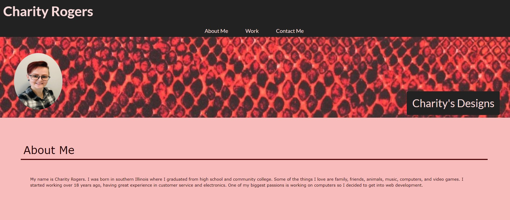

# My Professional Portfolio - Charity's Designs

## Objective

Create a website including my name, recent photo and links to sections about me, my work and how to contact me. Create a navigation bar that takes you to specific sections of the page. Present a responsive layout that adapts to my viewport when you resize the page or view on various devices.

## Review

- Deployed application: [https://rogerscl116.github.io/charitys-designs](https://rogerscl116.github.io/charitys-designs)
- GitHub repository: [https://github.com/rogerscl116/charitys-designs](https://github.com/rogerscl116/charitys-designs)

## Screenshot

*Created by Charity Rogers*
